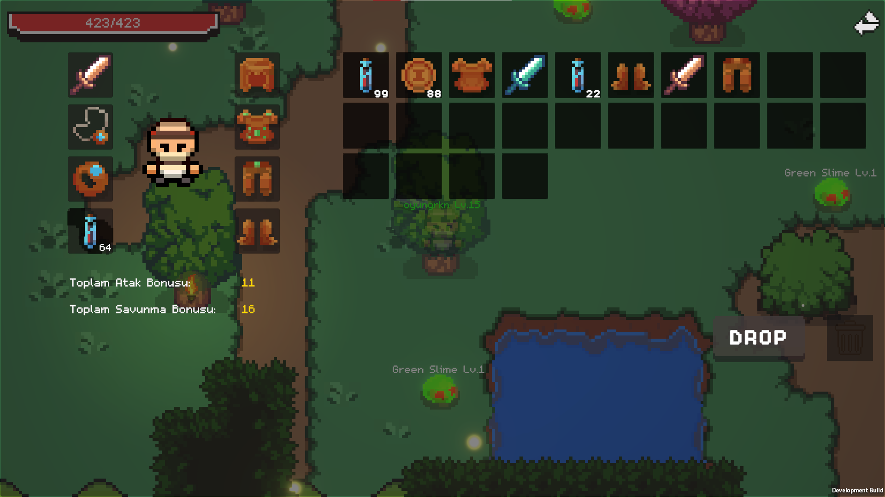
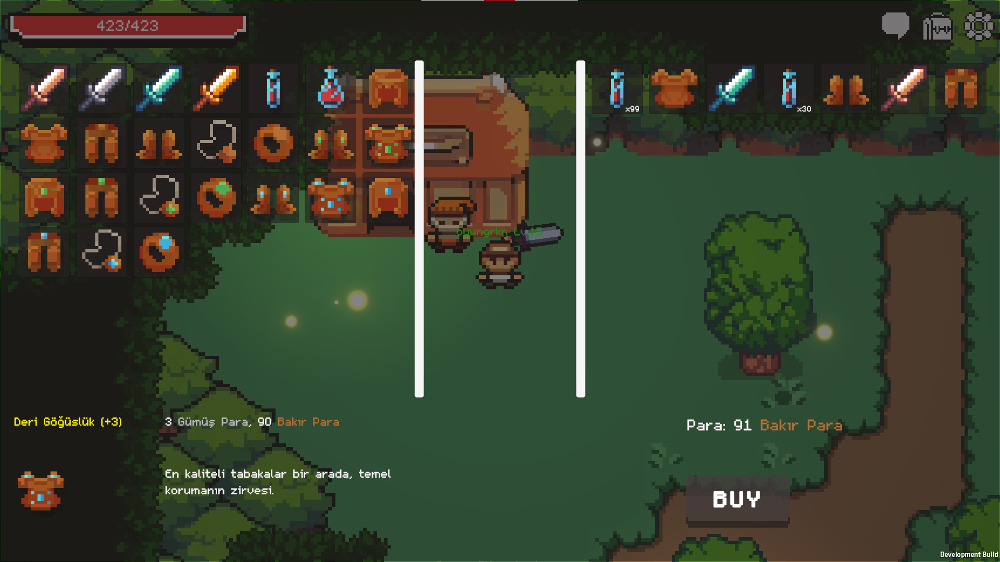

# 🎮 OnlineRPG Scripts

<div align="center">
  
  
  
  
</div>


---

## ✨ Özellikler

🕹️ **Gelişmiş Oyuncu Sistemi**
- Player controller ve hareket kontrolleri
- Sağlık ve can yönetimi
- Oyuncu istatistikleri ve seviye sistemi
- Emote sistemi ve sosyal etkileşimler
- Karakter görünümü ve isim etiketleri

⚔️ **Akıllı Düşman Sistemi**
- Gelişmiş AI ve pathfinding teknolojisi
- Sağlık sistemi ve hasarlanma
- Dinamik düşman isim etiketleri
- Elite düşman sistemi ve özel görsel efektler
- Loot sistemi ve drop mekanikleri

🎒 **Kapsamlı Envanter Sistemi**
- Tam özellikli envanter yönetimi
- Drag & drop interface
- Ekipman sistemi ve otomatik stat bonusları
- Item veritabanı ve veri yönetimi
- Firebase ile bulut senkronizasyonu

🛒 **Ticaret ve Shop Sistemi**
- Tüccar NPC'leri ve etkileşim
- Gelişmiş shop UI
- Para birimi sistemi
- Alım-satım mekanikleri

🌐 **Multiplayer Alt Yapısı**
- Photon PUN2 ile real-time multiplayer
- Sunucu yönetimi
- Oda yönetimi ve oyuncu senkronizasyonu
- Network optimizasyonları ve RPC sistemleri

🔥 **Firebase Cloud Sistemi**
- Kullanıcı kimlik doğrulama
- Cloud Firestore veri yönetimi
- Real-time database senkronizasyonu
- Oyuncu verilerinin otomatik kaydedilmesi

🎨 **Gelişmiş UI Sistemi**
- Ana UI yönetimi
- Modern shop arayüzü
- Chat sistemi
- Feedback ve tooltip sistemleri
- Dinamik sağlık barları

🎵 **Audio Yönetimi**
- Ses efektleri kontrolü
- SFX sistemleri
- Dinamik ses yönetimi

🧪 **Test ve Yardımcı Sistemler**
- Test araçları ve debugging
- Yardımcı sınıflar
- Main thread dispatcher
- Mesaj renklendirme

## 📁 Detaylı Klasör Yapısı

```
📦 Scripts
├── 🎮 Player/                   # Oyuncu Sistemleri
│   ├── PlayerController.cs     # Ana oyuncu kontrolü ve hareket
│   ├── PlayerHealth.cs         # Sağlık sistemi ve hasarlanma
│   ├── PlayerStats.cs          # Seviye, XP ve stat yönetimi
│   ├── PlayerNameTag.cs        # Oyuncu isim etiketi
│   ├── Player Controls.cs      # Input sistemi
│   └── Sword/                  # Kılıç sistemi
│       ├── Sword.cs           # Kılıç kontrolü
│       ├── SlashAnim.cs       # Saldırı animasyonu
│       └── PlayerDamage.cs    # Hasar sistemi
│
├── 👹 Enemy/                   # Düşman Sistemleri
│   ├── EnemyAI.cs             # Düşman yapay zekası
│   ├── EnemyHealth.cs         # Düşman sağlık sistemi
│   └── EnemyNameTag.cs        # Düşman isim etiketi
│
├── 👥 NPCs/                    # NPC Sistemleri
│   └── Merchant.cs            # Tüccar NPC ve etkileşim
│
├── 🎒 Items/                   # Item ve Loot Sistemleri
│   └── LootItem.cs            # Loot toplama mekanikleri
│
├── 📦 Scripts/                 # Ana Sistemler
│   ├── Inventory/             # Envanter Alt Sistemi
│   │   ├── InventoryManager.cs      # Envanter yönetimi
│   │   └── InventorySlotUI.cs       # Slot UI kontrolü
│   └── Managers/              # Oyun Yöneticileri
│       ├── EquipmentManager.cs      # Ekipman sistemi
│       ├── PhotonServerManager.cs   # Photon sunucu yönetimi
│       ├── ChatManager.cs          # Chat sistemi
│       └── SFXNames.cs             # Ses efekti isimleri
│
├── 🖥️ UI/                      # Kullanıcı Arayüzü
│   ├── UIManager.cs           # Ana UI kontrolü
│   ├── PlayerHealthUI.cs      # Sağlık bar UI
│   ├── ShopUIManager.cs       # Shop arayüzü
│   └── ShopItemUI.cs          # Shop item UI
│
├── 🔧 Utils/                   # Yardımcı Araçlar
│   ├── UnityMainThreadDispatcher.cs  # Thread yönetimi
│   ├── MessageColorUtils.cs          # Mesaj renklendirme
│   ├── CurrencyUtils.cs              # Para birimi araçları
│   └── CurrencyTestManager.cs        # Para test sistemi
│
├── 🧪 Tests/                   # Test Sistemleri
│   └── [Test dosyaları]       # Debug ve test araçları
│
├── 🌍 Environment/             # Çevre Sistemleri
│   └── [Çevre objeleri]       # Dünya etkileşim objeleri
│
├── 🔊 Audio/                   # Ses Sistemleri
│   ├── AudioManager.cs        # Ana ses yöneticisi
│   └── ShakyText.cs          # Titreşimli text efekti
│
└── 📱 MainMenu/               # Ana Menü
    └── [Menü sistemleri]      # Ana menü ve UI
```

## 🛠️ Teknolojiler

<table>
<tr>
<td align="center">
  <br />
  <b>Unity 2022.3+</b>
</td>
<td align="center">
  <br />
  <b>C# (.NET)</b>
</td>
<td align="center">
  <br />
  <b>PUN2 Multiplayer</b>
</td>
</tr>
<tr>
<td align="center">
  <br />
  <b>Firebase</b>
</td>
<td align="center">
  <br />
  <b>A* Pathfinding</b>
</td>
<td align="center">
  <br />
  <b>JSON Data</b>
</td>
</tr>
</table>

## 🚀 Kurulum

### Gereksinimler
- Unity 2022.3 veya daha yeni sürüm
- .NET Framework 4.7.1+
- Git (version control için)

### Adım Adım Kurulum

1. **📥 Repository'yi klonlayın**
   ```bash
   git clone https://github.com/grknsytrk/online-rpg.git
   ```

2. **📁 Unity projenizde Assets/Scripts klasörüne kopyalayın**

3. **📦 Gerekli paketleri import edin**
   - Photon PUN2 (Multiplayer)
   - Firebase SDK
   - A* Pathfinding Project
   - TextMeshPro

4. **⚙️ Scene'leri ayarlayın ve prefab'ları bağlayın**

5. **🔧 Firebase konfigürasyonunu yapın**
   - `google-services.json` dosyasını ekleyin
   - Authentication ve Firestore'u aktifleştirin

## 🤝 Katkıda Bulunma

1. Bu repository'yi fork edin
2. Feature branch oluşturun (`git checkout -b feature/amazing-feature`)
3. Değişikliklerinizi commit edin (`git commit -m 'Add amazing feature'`)
4. Branch'inizi push edin (`git push origin feature/amazing-feature`)
5. Pull Request oluşturun

## 📸 Screenshots

### 🎮 Oyun İçi Görüntüler

<div align="center">

**Ana Oyun Ekranı**


**Envanter Sistemi**


**Shop Sistemi**


**Multiplayer Oyun**


</div>

> **Not:** Screenshot'ları eklemek için `assets/images/` klasörüne görsellerinizi koyun ve yukarıdaki dosya isimlerini kullanın.

## 📝 Değişiklik Günlüğü

### v1.0.0
- ✅ Temel oyuncu sistemi
- ✅ Multiplayer desteği
- ✅ Firebase entegrasyonu
- ✅ Envanter sistemi

## 📞 İletişim

- **GitHub**: [@grknsytrk](https://github.com/grknsytrk)
- **Email**: oyungrkn@gmail.com

## 📄 Lisans

Bu proje [MIT Lisansı](LICENSE) altında lisanslanmıştır. Detaylar için [LICENSE](LICENSE) dosyasına bakınız.

**Özet:**
- ✅ Ticari kullanım
- ✅ Değiştirme
- ✅ Dağıtım
- ✅ Özel kullanım
- ❌ Sorumluluk
- ❌ Garanti

---

<div align="center">
  <b>⭐ Bu projeyi beğendiyseniz star vermeyi unutmayın! ⭐</b>
</div>
