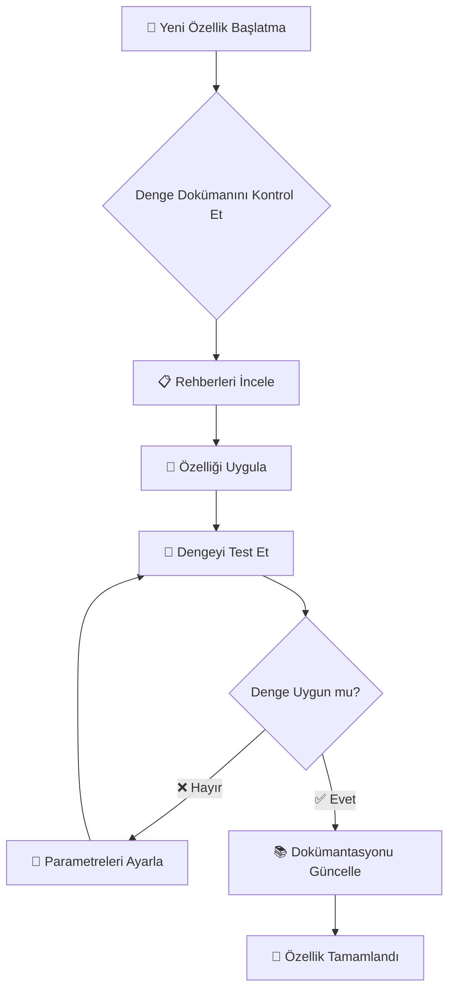

<div align="center">

# 📚 Oyun Dokümantasyonu


*Online RPG oyun sistemleri ve mekanikleri için kapsamlı dokümantasyon*

</div>

---

## 📋 Dosya Genel Bakış

### 🎯 `oyun_ici_denge_sistemi.pdf`
<div align="center">

</div>

**Oyun Denge Sistemi Dokümantasyonu**

<table>
<tr>
<td align="center" width="50%">

### 📈 **Oyuncu Sistemleri**
- 🆙 Oyuncu ilerleme dengesi
- 🌟 Deneyim puanı dağılımı
- ⚡ Karakter istatistik skalası
- 🏆 Başarım dengesi

</td>
<td align="center" width="50%">

### ⚔️ **Savaş & Ekipman**
- 🛡️ Ekipman denge mekanikleri
- ⚔️ Savaş sistemi dengesi
- 🏹 Silah skalasyon formülleri
- 💎 Nadir Eşya bulma dağılımı

</td>
</tr>
<tr>
<td align="center" width="50%">

### 💰 **Ekonomi & Ticaret**
- 💰 Ekonomik sistem dengesi
- 🛒 Mağaza fiyatlandırma stratejileri
- 💱 Para birimi değişim oranları
- 📊 Pazar kararlılık metrikleri

</td>
<td align="center" width="50%">

### 🌍 **Dünya & PvP**
- 🗺️ Seviye tasarım değerlendirmeleri
- 🥊 PvP denge mekanikleri
- 🏰 Bölge zorluğu skalası
- 🎮 Son oyun içerik dengesi

</td>
</tr>
</table>

---

## 🎯 Amaç

<div align="center">

**Bu dokümantasyon şu amaçlar için kapsamlı rehber olarak hizmet eder:**

</div>

<table>
<tr>
<td align="center">
  <br />
  <b>Oyun Dengesi Referansı</b><br />
  <sub>Teknik özellikler ve formüller</sub>
</td>
<td align="center">
  <br />
  <b>Yeni Özellik Dokümantasyonu</b><br />
  <sub>Yeni sistemleri uygulama rehberleri</sub>
</td>
<td align="center">
  <br />
  <b>Denge Ayarlama Kuralları</b><br />
  <sub>Oynanış değişiklikleri için kriterler</sub>
</td>
</tr>
<tr>
<td align="center">
  <br />
  <b>Kalite Güvencesi</b><br />
  <sub>Test kriterleri ve doğrulama</sub>
</td>
<td align="center">
  <br />
  <b>Performans Metrikleri</b><br />
  <sub>Veri analizi ve içgörüler</sub>
</td>
<td align="center">
  <br />
  <b>Tasarım Felsefesi</b><br />
  <sub>Temel tasarım prensipleri ve desenleri</sub>
</td>
</tr>
</table>

---

## 🛠️ Kullanım Rehberi

### 🔍 **Dokümantasyona Ne Zaman Başvurulmalı**

<div align="center">



</div>

### 📚 **Geliştirici İş Akışı**

| 🔧 **Geliştirme Aşaması** | 📖 **Dokümantasyon Kullanımı** | 🎯 **Ana Odak Alanları** |
|---------------------------|----------------------------|------------------------|
| 🌟 **Özellik Planlaması** | Mevcut denge sistemlerini gözden geçir | Oyuncu ilerlemesi, ekonomi etkisi |
| 🔨 **Uygulama** | Skalasyon formüllerini ve oranlarını takip et | Savaş mekanikleri, stat hesaplamaları |
| ⚖️ **Denge Testi** | Belgelenmiş kriterlere göre doğrula | PvP adaleti, ilerleme eğrisi |
| 🧪 **QA Doğrulaması** | Test kriterlerini kullan | Performans metrikleri, oyuncu geri bildirimi |
| 📊 **Yayın Sonrası** | Verilere dayalı izle ve ayarla | Ekonomik kararlılık, oyuncu tutma |

---

## 🤝 Katkı Rehberleri

### 📝 **Denge Güncelleme Süreci**

<div align="center">

**🔄 Oyun dengesi güncellenirken şu iş akışını takip edin:**

</div>

```bash
# 1️⃣ Araştırma Aşaması
📊 Mevcut oyun verilerini analiz et
📖 Mevcut dokümantasyonu gözden geçir
🎮 Oyuncu geri bildirimlerini topla

# 2️⃣ Planlama Aşaması
📋 Önerilen değişiklikleri belgele
🧮 Etki metriklerini hesapla
⚖️ Denge prensiplerine göre doğrula

# 3️⃣ Uygulama Aşaması
🔧 Test ortamında değişiklikleri uygula
🧪 Kapsamlı test yürüt
📈 Ana performans göstergelerini izle

# 4️⃣ Dokümantasyon Aşaması
📝 Denge dokümantasyonunu güncelle
📊 Değişiklik gerekçesini kaydet
🗂️ Sürüm geçmişini koru
```

### 🏷️ **Sürüm Kontrol Standartları**

<table>
<tr>
<td align="center">
  <br />
  <b>Büyük Değişiklikler</b><br />
  <sub>Komple sistem revizyonları</sub>
</td>
<td align="center">
  <br />
  <b>Küçük Ayarlamalar</b><br />
  <sub>Kademeli denge ince ayarları</sub>
</td>
<td align="center">
  <br />
  <b>Hotfix'ler</b><br />
  <sub>Kritik denge sorunları</sub>
</td>
</tr>
</table>

---

## 🔗 İlgili Kaynaklar

<div align="center">

### 📚 **Dokümantasyon Bağlantıları**

| 📄 **Belge** | 🎯 **Amaç** | 🔗 **Konum** |
|-----------------|----------------|-----------------|
| **Ana README** | Teknik uygulama rehberi | [📁 Proje Kökü](../../README.md) |
| **Oyun Script'leri** | C# uygulama dosyaları | [💻 Scripts Klasörü](../../) |
| **Varlıklar Rehberi** | Görsel varlıklar dokümantasyonu | [🖼️ Images Klasörü](../images/) |

### 🛠️ **Araçlar & Teknolojiler**


</div>

---

<div align="center">

**⭐ Teknik uygulama detayları için ana [README.md](../../README.md) dosyasına bakınız ⭐**

<sub>📅 Son Güncelleme: Haziran 2025 | 📋 Durum: Tamamlandı | 🎯 Kapsam: Kapsamlı</sub>

</div>
